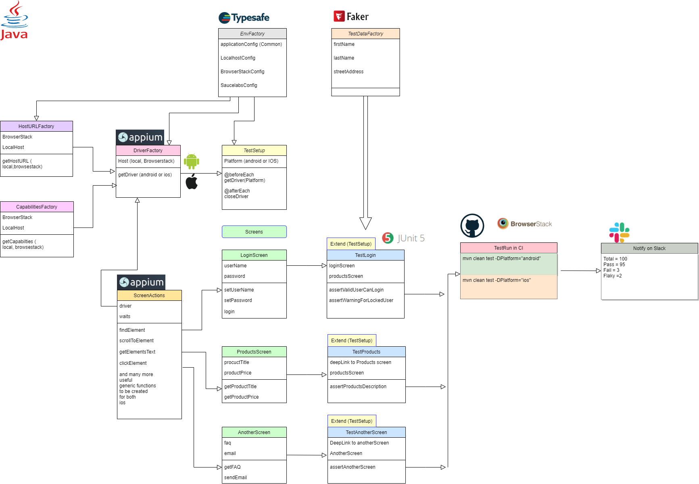

# happium 😊 📱


[](https://app-automate.browserstack.com/public-build/cTlFOU8vNlpqZnhhVWRjT2EyZXJGNEppbzFJbjRraURNS1JtMzdNbC9RRT0tLXNGVk9VM0NTZm02cFE1bUZOa3ZXbXc9PQ==--5f4e79b4c764eb53057470ee101c93f2c45f4b37?redirect=true)
[](https://github.com/PramodKumarYadav/happium/actions/workflows/maven.yml)

Happium is an open source **production ready** test framework on Appium, the core of which is **directly reusable** in your project with minimum configuration changes.

Framework uses **Junit5** and provides **4 different modes of running your tests in parallel** on a **local machine**, and a **clean design**, with **clear separation of concerns**, that results in **high readability** and **low maintenance**; all in all a **pleasure to work with**! 

`P.S: And yes, this probably maybe the only framework on the internet (using Junit5), that provides 4 modes of execution on localhost (there are examples to run on browsertack and saucelabs but on localhost this is the first - or atleast I couldnt find another one). And it is only going to get better and better from here.`

`If you see an issue or want to get a feature added; feel free to open an issue in the framework. If you have a cool idea that can make the framework better, do send me a request and I will add you as a contributor :).`

## Getting started
- Clone this project in one of your drives.
  - `git clone https://github.com/PramodKumarYadav/happium.git`
- Specify `host`, `platform`, `app` env and `device` choices from application.conf and selected environments conf file.
- If running in localhost; you would first need to start appium server: `appium --base-path /wd/hub`
- If running in browserstack or saucelabs, you can skip running of server step.
- Run tests

## Open source sponsor's
I would like to say a big thank you to our open source sponsors `browserstack` and `saucelabs`.
They both provide sponsorship to run project Happium on cloud with a free open source license - with 5 parallel licences and unlimited testing time! 
Due to their support, we should be able to cover both these options in detail for running tests in parallel on cloud!
<br>


## High level design
Below you find the simple yet powerful happium design.  
Each area is neatly separated, handling only its own concerns, allowing for easy maintenance and scalability in the framework.

Note: At the moment of writing this section, Factories and singleton patterns are used to achieve `separation of concerns` and to reuse common entities (such as env config).
Expect more cleanup and design enhancements in coming days and weeks!



## Key features
- **A clean design** with clear separation of concerns
- **4 local parallel modes of execution**
    - [x] CLASS_SERIES_TEST_SERIES,
    - [x] CLASS_SERIES_TEST_PARALLEL,
    - [x] CLASS_PARALLEL_TEST_SERIES,
    - [x] CLASS_PARALLEL_TEST_PARALLEL
- **Readable tests** that separates test intentions from test implementation. 
- **Screen object model** based on page object model, to design and write screen classes. 
- **Easy maintenance** and **scalability** is what **happium** offers!

##  Objectives
- [x] Atomic independent tests
- [x] Core framework to be fully plug and play. Just change configuration as per your app and write domain and tests as per your app.
- [x] Four different modes of execution - just by selecting a config option.
    - [x] serial (all tests) - preferred mode when you want to test/debug a particular device.
    - [x] parallel ( all Test Classes and within each test class, run in serial). Preferred mode for running tests in CI.
    - [x] parallel ( all Test cases with a Class but all Test classes in series (one after another). - Preferred mode when building new tests for a test class and testing if all tests can run in parallel without issues before pushing them to GitHub.
    - [x] parallel ( all Test Classes and within each test class, all tests also run in parallel) - a total beast mode if your machine can handle it - that is :-).
- [x] A very clean design with very high separation of concerns.
    - [x] This means every entity is highly readable, maintainable and scale able.
    - [x] Tests, app, data, config, domain, framework entities, everything is well separated and results in near zero duplication anywhere.
- [x] Framework design allows you to write highly readable tests.
    - [x] So tests read like reading english (with test intentions rather than implementation logic).
    - [x] Tip: Take examples as a guide and Use page object model to write your screen entities and separate test intentions from screen implementation to write readable tests.
- [x] With time, to add more common methods that will build a library of actions that will bring stability and capabilities to what you can do on your screens/ apps.
- [x] Deep linking examples to show how you can speed up your test execution
    - [x] Skip login and show how application *state* can be set using deeplinks to test a particular screen; instead of logging in every time.
    - [x] Login is the only class where we should test all login scenarios. For testing other screens heavily use deeplinks (if you can).
    - [x] Note: You should have a very few end to end scenarios that involves actual end to end flows via login and user interactions.
- [X] How to install Appium on windows with an automated script (avoid manual setup)
  Use happium for **appium** and be happy automating mobile apps!

## Parallel Execution modes
Below are all parallel execution modes. The parallel properties are coming from file resources -> **junit-platform.properties**

| **Sr No:** | **Scenario**                                                                                                        | **parallel.enabled**          | **parallel.mode.classes.default**      (for classes) | **parallel.mode.default**        (for tests) | **config.strategy**        (dynamic or fixed) | **Factor**      dynamic.factor = say (2) OR      fixed.parallelism = say (4) | **No: Of   available devices**. Also listed in class say AndroidEmulators Class for android tests.              |                                                                                                                                                 **NOTE 1**                                                                                                                                                |                                                 **NOTE 2**                                                 |                                                                                                                                                                     **Results**                                                                                                                                                                    |
|--------|------------------------------------------------------------------------------------------------------------------|:-------------------------:|:------------------------------------------------:|:-----------------------------------------:|:------------------------------------------:|:------------------------------------------------------------------------:|:-----------------------------------------------------------------------------------------------------------:|-------------------------------------------------------------------------------------------------------------------------------------------------------------------------------------------------------------------------------------------------------------------------------------------------------|--------------------------------------------------------------------------------------------------------|------------------------------------------------------------------------------------------------------------------------------------------------------------------------------------------------------------------------------------------------------------------------------------------------------------------------------------------------|
| 1      | Run all classes   and tests in series. i.e.      **CLASS_SERIES_TEST_SERIES**.                                       | FALSE                     |                                                  |                                           |                                            |                                                                          | Atleast one   emulator as listed in deviceName in application.conf                                          | Only need the   one device listed in application.conf file say, deviceName="Pixel_4_API_31"                                                                                                                                                                                                           | Preferred mode in local debug mode   where you are focussing on building/debugging a single test case. | All classes run   in series. Within each class, all tests run in series.                                                                                                                                                                                                                                                                       |
|    2   | Run   all classes and tests in series. i.e.      **CLASS_SERIES_TEST_SERIES**.                                       | TRUE                      | same_thread                                      | same_thread                               |                                            |                                                                          | Atleast   one emulator as listed in deviceName in application.conf                                          | Only   need the one device listed in application.conf file say, deviceName="Pixel_4_API_31"                                                                                                                                                                                                           | Preferred mode in local debug mode   where you are focussing on building/debugging a single test case. | Will run one test at a time,   starting from say LoginTest class.       Execution Order:      LoginTest (TC1 ->   TC2 -> TC3)      ProductTest  (TC1 -> TC2 )      ProductsTest (TC1   -> TC2 -> TC3  -> TC4)                                                                                                                                  |
|    3   | Run   all classes in series. Run all tests within a class in parallel.  i.e.      **CLASS_SERIES_TEST_PARALLEL**.    | TRUE                      | same_thread                                      | concurrent                                |                                            |                                                                          | >= max number of tests within any of the class OR if fixed thread count provide than >= fixed thread count. | Example   say if LoginClass has max nr   of tests compared to any other class say = 6 test cases. Then either we need   6 or more emulators OR   if the thread count is fixed to say 2. Then having 2 emualotres will suffice   since at any given time only two emulators are going to be up.        | Preferred mode in local mode where   you are focussing on building/debugging a single test   class.    | Will run all test classes one after another in series. However   within a class, will run all test cases in parallel.      Execution Order:      LoginTest (TC1 :   TC2  :TC3) -> all in parallel      \| then     ProductTest  (TC1 : TC2 ) -> all in parallel      \| then     ProductsTest (TC1 :   TC2  : TC3  : TC4) -> all   in parallel |
|    4   | Run   all classes in parallel. Run all tests within a class in series.  i.e.      **CLASS_PARALLEL_TEST_SERIES**     | TRUE                      | concurrent                                       | same_thread                               |                                            |                                                                          | >= total count of testClasses  OR if fixed thread count provide than >= fixed thread count.                 | Example   say if there are in total 5 Test classes (with any number of tests in them - doesnt matter). Then   either we need 5 or more emulators OR, if the thread count is fixed to say 2. Then having 2   emualotres will suffice since at any given time only two emulators are going   to be up.  | Preferred   mode in CI.                                                                                | Will run all test classes in parallel. However within a class,   will run all test cases in series      Execution Order:       LoginTest, ProductTest and Products test -> all in parallel      TC1 -> TC2 -> TC3) all tests in series within each class       TC1 -> TC2 )      TC1 -> TC2 -> TC3  -> TC4)                                    |
| 5      | Run   all classes in parallel. Run all tests within a class in parallel.  i.e.      **CLASS_PARALLEL_TEST_PARALLEL** | TRUE                      | concurrent                                       | concurrent                                |                                            |                                                                          | >= total count of all test cases within all testClasses                                                     | Example   say if there are in total 3 Test classes (and within each test class there are 4 test cases) . Then we   woul need 3*4 = 12 emulators.     Although note that trying to run such high nr of emulators is most   probably going to choke your machine.                                       | Only   where you have a huge infrastructure to support running of all your tests in   parallel.        | Will run all test classes in parallel. Within a class, will run   all test cases also in parallel      Execution Order:       LoginTest, ProductTest and Products test -> all in parallel       (TC1 : TC2  :TC3) -> all in parallel      (TC1 : TC2 ) -> all in parallel      (TC1 : TC2  : TC3  : TC4) -> all in parallel                    |

## Working principles
There are two key principles you will see throughout being followed in the project. 
- **For tests**: I will follow the principle of `seperating test intentions from test implementation`. Meaning, you will only see test intentions in the tests without any code implementation details in tests. 
> This results in highly readable `tests`, with low/zero code duplication. 
- **For code**: I will follow `seperation of concerns` principles. Broadly this means keeping code, config and data seperate. More importantly you will see this principle followed heavily within code to create classes and functions that follow clean code principles and are thus highly readable and easily maintainable.
> This results in highly readable `code` with no code duplication.

## Working approach
When I learn a new tool or technology, my working approach is to `first make it work` and `then make it better`. Thus refactoring is a `way of life` in all my projects. Following the scout and guides principle that if you touch a class, you have to `leave code cleaner than you found it`. Eventually this approach would result in the code that looks like what I mentioned before in the working principles.   

## Installation (dependencies and appium)
- For windows setup: Go to install folder in root directory. Now refer powershell script named `Install-AppiumOnWindows.psm1`
- To do a full setup on Windows; execute below commands.

```
- cd to this project. Say (cd D:\happium\)
- Import-Module .\install\Install-AppiumOnWindows.psm1 -Force
- Install-AppiumDependencies
- close this terminal. Check that you have node properly installed and available using npm -v and node -v commands. If you see versions, then run:
- Install-Appium 

P.S: To install any dependency that may have not properly installed in previous step. Close the current terminal. Open a new one as administrator and now run the function name. 
For example to only install appium-doctor, run on terminal.
- Install-AppiumDoctor
```
#Setup
-[X] Clone the sample apps repository and get some apps for testing.
    - Run git clone https://github.com/appium/sample-apps.git (to get 3 apk apps). Use "ContactManager.apk" from this list. Put it in apps folder.
    - npm install sample-apps (to install all the apps)
-[ ] Now we have the app. Let's create a driver factory that will give us a emulator for any avd that we ask for.

## Reference
- [Sample apps to use for testing](https://github.com/appium/sample-apps)
- [markdownguide](https://www.markdownguide.org/extended-syntax/)

## Troubleshooting tips
- 1) It seems when I start appium server from *appium-desktop*, there are lesser issues with running avds from tests in parallel/or stand alone. 
     
    So to avoid issues, always launch *appium-desktop* unless you find a stable fix for launching from appium terminal.
      
    Launching appium server from terminal, works sometimes and not on other times. The error I see most often when running tests from appium terminal is while 
    making a call to pixelratio endpoint: GET http://127.0.0.1:8201/wd/hub/session/16cc5cc1-9507-4d03-9282-1e8bded63c3c/appium/device/pixel_ratio
    
see detailed logs below: 
``` 
[debug] [ADB] Getting focused package and activity
[debug] [ADB] Running 'C:\Users\Pramod Yadav\AppData\Local\Android\Sdk\platform-tools\adb.exe -P 5037 -s emulator-5554 shell dumpsys window displays'
[debug] [ADB] Found package: 'com.swaglabsmobileapp' and fully qualified activity name : 'com.swaglabsmobileapp.MainActivity'
[debug] [WD Proxy] Proxying [GET /appium/device/pixel_ratio] to [GET http://127.0.0.1:8201/wd/hub/session/16cc5cc1-9507-4d03-9282-1e8bded63c3c/appium/device/pixel_ratio] with no body
[WD Proxy] socket hang up
[debug] [UiAutomator2] Deleting UiAutomator2 session
[debug] [UiAutomator2] Deleting UiAutomator2 server session
[debug] [WD Proxy] Matched '/' to command name 'deleteSession'
[debug] [WD Proxy] Proxying [DELETE /] to [DELETE http://127.0.0.1:8201/wd/hub/session/16cc5cc1-9507-4d03-9282-1e8bded63c3c] with no body
[WD Proxy] socket hang up
[UiAutomator2] Did not get confirmation UiAutomator2 deleteSession worked; Error was: UnknownError: An unknown server-side error occurred while processing the command. Original error: Could not proxy command to the remote server. Original error: socket hang up
[debug] [ADB] Running 'C:\Users\Pramod Yadav\AppData\Local\Android\Sdk\platform-tools\adb.exe -P 5037 -s emulator-5554 shell am force-stop com.swaglabsmobileapp'
[debug] [Logcat] Stopping logcat capture
[debug] [ADB] Removing forwarded port socket connection: 8201
[debug] [ADB] Running 'C:\Users\Pramod Yadav\AppData\Local\Android\Sdk\platform-tools\adb.exe -P 5037 -s emulator-5554 forward --remove tcp:8201'
[UiAutomator2] Restoring hidden api policy to the device default configuration
[debug] [ADB] Running 'C:\Users\Pramod Yadav\AppData\Local\Android\Sdk\platform-tools\adb.exe -P 5037 -s emulator-5554 shell 'settings delete global hidden_api_policy_pre_p_apps;settings delete global hidden_api_policy_p_apps;settings delete global hidden_api_policy''
[debug] [BaseDriver] Event 'newSessionStarted' logged at 1633635690879 (21:41:30 GMT+0200 (Central European Summer Time))
[debug] [W3C] Encountered internal error running command: UnknownError: An unknown server-side error occurred while processing the command. Original error: Could not proxy command to the remote server. Original error: socket hang up
[debug] [W3C]     at UIA2Proxy.command (C:\Users\Pramod Yadav\AppData\Roaming\npm\node_modules\appium\node_modules\appium-base-driver\lib\jsonwp-proxy\proxy.js:274:13)
[debug] [W3C]     at processTicksAndRejections (node:internal/process/task_queues:96:5)
[debug] [W3C]     at AndroidUiautomator2Driver.commands.getDevicePixelRatio (C:\Users\Pramod Yadav\AppData\Roaming\npm\node_modules\appium\node_modules\appium-uiautomator2-driver\lib\commands\viewport.js:14:10)
[debug] [W3C]     at AndroidUiautomator2Driver.fillDeviceDetails (C:\Users\Pramod Yadav\AppData\Roaming\npm\node_modules\appium\node_modules\appium-uiautomator2-driver\lib\driver.js:238:28)
[debug] [W3C]     at AndroidUiautomator2Driver.createSession (C:\Users\Pramod Yadav\AppData\Roaming\npm\node_modules\appium\node_modules\appium-uiautomator2-driver\lib\driver.js:224:7)
[debug] [W3C]     at AppiumDriver.createSession (C:\Users\Pramod Yadav\AppData\Roaming\npm\node_modules\appium\lib\appium.js:387:35)
[HTTP] <-- POST /wd/hub/session 500 18594 ms - 1350
[HTTP]
[debug] [ADB] Waiting up to 20000ms for activity matching pkg: 'com.swaglabsmobileapp' and activity: 'com.swaglabsmobileapp.MainActivity' to be focused
[debug] [ADB] Possible activities, to be checked: 'com.swaglabsmobileapp.MainActivity', 'com.swaglabsmobileapp.com.swaglabsmobileapp.MainActivity'
```

- 2) Also it seems, Appium-desktop is only able to open the images created by android-studio (say Pixel_XL_API_31.avd). 
     If you have created an image by avd (say Pixel_5_API_31.avd), it seems appium-desktop keep throwing different kind of errors and cannot create a session. 
    - [ ] So create avd devices using android studio
- 3) If you want to launch emulator from tests. 
      - *One*, you must use an image created by *android studio* (say Pixel_XL_API_31.avd). Giving another image not created from studio (say Pixel_5_API_31.avd) will fail. 
      - *Two*, You must give the absolute path of the app. 
        Note that when the emulator is started manually via the android studio, then you can even give a relative path and tests works. 
        However, if you want to launch emulator and app from the tests, then you have to take care of both above points (Absolute path and an app created via android studio)
-  4. If you have to use @beforeEach and @afterEach method also in tests, give them a seperate name than the ones mentioned in the TestSetup. If you give the same names, the methods in
   Tests will override the methods in TestSetup and thus your tests will either result into failure or unexpected behavior. So beware of this.
